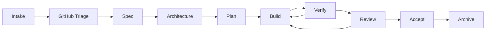

# Control Board

Use this board as a human-readable workflow overview. Keep it compact and link to detailed state files instead of duplicating them.

## Overall Pipeline

## Active Workflows

| Workflow | Stage | Status | GitHub | Next | Evidence |
| --- | --- | --- | --- | --- | --- |
|  |  |  |  |  |  |

## Risk Board

| Risk | Level | Mitigation |
| --- | --- | --- |
| Controller edits implementation directly | Medium | Use role gates and allowed-writes lists |
| Worker output missing or stale | Medium | Follow patience policy, then classify worker status |
| PR merged before human testing | High | Enforce human merge gate |

## Operating Metrics

- active workflow count
- active worker count
- completed tasks this week
- blocked tasks
- PRs open for human testing
- Actions status
- repeated failure patterns

